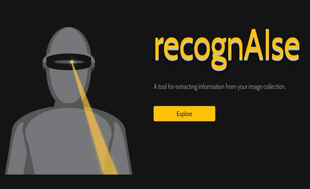
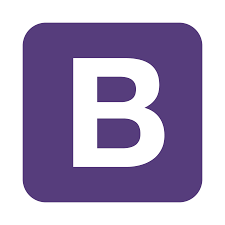

# recognAIse

*How many times have you desired to get an editable file instead of the traditional piece of paper you can’t work with? Let’s imagine you have a magazine article or a simply PDF and want to digitize it. Sure, you can scan the document and have it on your computer, but it won’t be editable, and you can’t make the needed changes in it. That’s when OCR software technology comes in to make your life easier.*

*Optical character recognition (OCR) technology is a business solution for automating data extraction from printed or written text from a scanned document or image file and then converting the text into a machine-readable form to be used for data processing like editing or searching.This technology helps not just digitizing documents but also improving data accessibility and enhancing file security.*

  

TECHSTACK
------

    
    
    
    
    
    
    
    

APPROACH :information_desk_person:
------
*To begin, we'll use a  main template that we've made in Photoshop.* 

*We then used a couple of demo templates to extract information.
Because users will not always upload exact cropped files, we developed a method that will first detect the  key frames from the demo templates, the image will be cropped.
Following that, we identified the regions where we needed to extract texts. 
We used tesseract to extract texts and openCV to place the view on the images.*

*And it will return  a CSV file with all of the information.*

*Finally, we designed it so that users can upload files and see them on the internet.*

  

CHALLENGES WE RAN INTO :confused:
------
*To begin with, we were unable to detect squares on the images in the computer vision part.We were ultimately able to solve this problem after some research.*

*Next, we had to deal with a development difficulty. Being a first time hacker we take this challenge to develop this model as well. Firstly we can't upload numerous files, and we can't return it since python can't read the picture path. It was the most difficult task for us, but with the aid of our seniors, we were able to overcome it.*

ACCOMPLISHMENTS THAT WE'RE PRODUD OF :sunglasses:
------
*The biggest accomplishment for us was that we learned so many new things in just 2 days.We were able to overcome all the challenges we faced and didn't lose hope even stayed up all night. It was tiring, but fun as well.*

DEVELOPERS
------
<!--

    <a href="https://www.linkedin.com/in/randrita-sarkar-8690591a1/" target="_blank"><u>Randrita Sarkar</u></a>  
    <a href="https://www.linkedin.com/in/poulami-mandal-524390195/" target="_blank"><u>Poulami Mandal</u></a>

-->

 
 

 

Project Demo https://bit.ly/3yUgFdw :octocat:

THANK YOU :tada:
--------------------------------

    <meta charset="UTF-8">
    <i> “Make it work, make it right, make it fast.” &#128151 </i>

